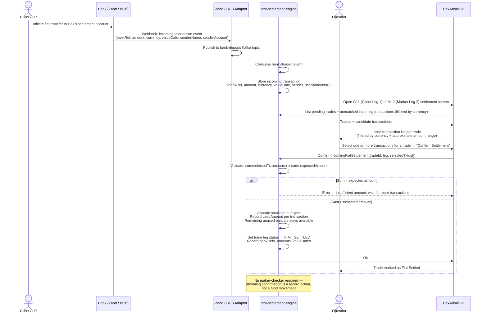

# Fiat Transfer Initiation — Tech Design

**Date:** 2026-05-15
**Status:** Draft
**Author:** rock.zeng
**Related spec:** [2026-05-12-fiat-initiation-on-settlement-design.md](./2026-05-12-fiat-initiation-on-settlement-design.md)

---

## 1. Architecture

### 1.1 Existing Bank Integration Layer

Three repos already form the bank integration stack:

| Repo | Role |
|---|---|
| `hexsafe-2-bank-gateway` | Central JRPC gateway; exposes `bank_InitiateTransfer`; routes to Zand or BCB adaptor by bank identifier |
| `hexsafe-2-zand-bank-adaptor` | Zand Bank API client; handles domestic + international transfers; publishes to `bank-deposit` / `bank-withdrawal` Kafka topics via webhooks |
| `hexsafe-2-bcb-bank-adaptor` | BCB Bank API client; exposes `bcb_bank_AuthorizePayment` (`POST https://api.bcb.group/v5/payments/authorise`); publishes to `bank-deposit` / `bank-withdrawal` Kafka topics via webhooks |

`htm-htm-settlement-engine` is already an authorised client of both adaptors.

### 1.2 Component Responsibilities for This Feature

```
HexAdmin UI
    │  JRPC
    ▼
htm-htm-settlement-engine          ← owns fiat leg state machine
    │  bank_InitiateTransfer (JRPC)
    ▼
hexsafe-2-bank-gateway             ← routes by bank identifier (Zand / BCB)
    │                    │
    ▼                    ▼
Zand adaptor         BCB adaptor
    │  webhook            │  webhook
    └──────────┬──────────┘
               ▼
    bank-deposit / bank-withdrawal (Kafka)
               │
               ▼
htm-htm-settlement-engine          ← consumes to update fiat leg status
```

- **`htm-htm-settlement-engine`** owns the fiat leg state machine; calls `bank_InitiateTransfer` for outgoing transfers; consumes `bank-deposit` / `bank-withdrawal` Kafka events to track status; integrates with quorum approval for maker-checker
- **`hexsafe-2-bank-gateway`** needs BCB routing added (currently only Zand is wired in); routing decision (Fedwire vs SWIFT+intermediary) is determined here based on beneficiary bank account data
- **`hexsafe-2-bcb-bank-adaptor`** — the BCB API `intermediary_bank` object supports both `bic` and `routing_number`; for USD SWIFT transfers routed via Standard Chartered, pass Standard Chartered's Fedwire/ABA number in `routing_number`
- **`HexAdmin UI`** adds the initiation screens, Fiat Transfers sub-tab under Pending Requests, and incoming transaction matching UI

### 1.3 Incoming Transaction Detection

Both Zand and BCB push webhooks for **all** incoming transactions on Hex's settlement accounts — not only transactions initiated through Hex's API. The adaptors publish these to the `bank-deposit` Kafka topic. The settlement engine consumes this topic to detect and store incoming transactions. **No polling job is needed.**

### 1.4 Fiat Leg State Machine

Fiat legs extend the existing `SettlementStatus` enum in `htm-htm-settlement-engine/internal/constant/status.go` with minimal new states.

**New states to add:**

| New state | Used by |
|---|---|
| `INCOMING_CLIENT_LEG_FIAT_PENDING_APPROVAL` | CL2: awaiting checker approval before bank transfer |
| `OUTGOING_LP_LEG_FIAT_PENDING_APPROVAL` | ML1: awaiting checker approval before bank transfer |
| `FIAT_TRANSFER_FAILED` | CL2, ML1, UC5: terminal failure after retries exhausted |

**State transitions:**

*CL2 — Outgoing fiat (Hex pays client):*
```
UNSETTLED
  → INCOMING_CLIENT_LEG_FIAT_PENDING_APPROVAL   (maker submits)
  → INCOMING_CLIENT_LEG_INITIATED               (reuse: bank transfer submitted after approval)
  → INCOMING_CLIENT_LEG_SETTLED                 (reuse: bank confirms via webhook)
  → FIAT_TRANSFER_FAILED                        (new: all retries exhausted)
  → UNSETTLED                                   (on checker rejection)
```

*ML1 — Outgoing fiat (Hex pays LP):*
```
UNSETTLED
  → OUTGOING_LP_LEG_FIAT_PENDING_APPROVAL       (maker submits)
  → OUTGOING_LP_LEG_INITIATED                   (reuse: bank transfer submitted after approval)
  → OUTGOING_LP_LEG_SETTLED                     (reuse: bank confirms via webhook)
  → FIAT_TRANSFER_FAILED                        (new: all retries exhausted)
  → UNSETTLED                                   (on checker rejection)
```

*CL1 — Incoming fiat (client pays Hex, ops confirms):*
```
UNSETTLED
  → OUTGOING_CLIENT_LEG_SETTLED                 (reuse: ops selects matching bank-deposit transactions)
```

*ML2 — Incoming fiat (LP pays Hex, ops confirms):*
```
UNSETTLED
  → INCOMING_LP_LEG_SETTLED                     (reuse: ops selects matching bank-deposit transactions)
```

---

## 2. Sequence Diagram — Fiat Initiation Flow (UC1 / UC2 / UC5)

```mermaid
sequenceDiagram
    actor Maker as Operator (Maker)
    actor Checker as Operator (Checker)
    participant UI as HexAdmin UI
    participant SE as htm-settlement-engine
    participant QA as Quorum Approval
    participant Mobile as HexSafe Mobile
    participant GW as bank-gateway
    participant Adaptor as Zand / BCB Adaptor
    participant Bank as Bank (Zand / BCB)

    Maker->>UI: Open CL2 / ML1 / Internal Transfer screen
    UI->>SE: Fetch trade / account data
    SE-->>UI: Trade details + eligibility info
    UI-->>Maker: Show "Initiate Fiat Settlement" (eligible) or ineligibility reason

    Maker->>UI: Click "Initiate Fiat Settlement"
    UI-->>Maker: Review screen (From, To, amount, transfer method)

    Maker->>UI: Submit
    UI->>SE: InitiateFiatTransfer(tradeId, fromAccount, toAccount, amount, currency, method)
    SE->>SE: Validate + set status → PENDING_APPROVAL
    SE->>QA: Create approval request (type: FiatTransfer)
    QA-->>SE: approvalRequestId
    SE-->>UI: OK (status: Pending Approval)
    UI-->>Maker: Confirmation — awaiting checker approval

    QA->>Mobile: Push notification → "Fiat Transfer Initiation" template
    Note over Mobile: Multi-page swipeable card<br/>Trade ID / Transfer Ref, Amount,<br/>From/To account details,<br/>Initiated by (Maker name + timestamp)

    Checker->>UI: Open Pending Requests → Fiat Transfers sub-tab
    UI->>SE: List pending fiat transfers
    SE-->>UI: Transfer details
    UI-->>Checker: Review transfer details

    Checker->>Mobile: Confirm approval on HexSafe mobile app
    Mobile->>QA: Approval confirmed
    QA->>SE: Kafka: quorum-approval-for-admin (APPROVED)

    SE->>SE: Set status → INITIATED
    SE->>GW: bank_InitiateTransfer(bankId, fromAccount, toAccount, amount, method, intermediary?)
    GW->>Adaptor: Route to Zand or BCB adaptor
    Adaptor->>Bank: POST /transfer (Zand) or POST /v5/payments/authorise (BCB)
    Bank-->>Adaptor: Transfer accepted (bank reference ID)
    Adaptor-->>GW: OK
    GW-->>SE: OK (bankReferenceId)
    SE->>SE: Record bankReferenceId, audit log

    Bank->>Adaptor: Webhook: transfer completed (bank tx ID, value date)
    Adaptor->>Adaptor: Publish to bank-withdrawal Kafka topic
    SE->>SE: Consume bank-withdrawal event
    SE->>SE: Set status → FIAT_SETTLED; record bank tx ID + value date

    Note over SE: On checker rejection:
    SE->>SE: Set status → UNSETTLED
    SE->>SE: Send Slack notification (ops + trading team)

    Note over SE: On bank API failure (after approval):
    SE->>SE: Auto-retry up to 3×, exponential backoff
    SE->>SE: If all retries fail → status → FIAT_TRANSFER_FAILED
    SE->>SE: Send Slack notification (ops + trading team)
```

---

## 3. Sequence Diagram — Incoming Fiat Transaction Confirmation Flow (UC3 / UC4)



---

## 4. Dev Effort and Dependencies

### 4.1 Service Breakdown

#### `hexsafe-2-bank-gateway` — **3–5 days**

| Task | Notes |
|---|---|
| Wire up BCB adaptor as a routing target | Currently only Zand is registered; add BCB client + route by bank identifier |
| BCB Fedwire routing logic | Evaluate beneficiary account data → choose Fedwire or SWIFT+intermediary; embed Standard Chartered Fedwire/ABA number as config |
| Integration tests with BCB adaptor | End-to-end routing test |

**Dependencies:** None (BCB adaptor already exists)

---

#### `hexsafe-2-bcb-bank-adaptor` — **2–3 days**

| Task | Notes |
|---|---|
| Verify `intermediary_bank.routing_number` wiring | Pass Standard Chartered Fedwire/ABA in `routing_number` for USD SWIFT transfers |
| `bank-withdrawal` Kafka topic publishing | Confirm webhook → Kafka pipeline handles BCB payment status callbacks correctly |
| Integration test: Fedwire and SWIFT+intermediary paths | Mock bank API responses |

**Dependencies:** None (pre-existing)

---

#### `htm-htm-settlement-engine` — **5–7 weeks**

| Task | Est. | Notes |
|---|---|---|
| DB migrations: new states, fiat transfer table, incoming tx table | 3d | New status enum values; fiat transfer record table (transferId, tradeId, leg, fromAccount, toAccount, amount, bankRef, status, retryCount, …); incoming bank tx table (bankRef, amount, currency, valueDate, sender, usedAmount) |
| New `SettlementStatus` enum values | 1d | `INCOMING_CLIENT_LEG_FIAT_PENDING_APPROVAL`, `OUTGOING_LP_LEG_FIAT_PENDING_APPROVAL`, `FIAT_TRANSFER_FAILED` |
| JRPC: `InitiateFiatTransfer` (CL2 / ML1) | 3d | Eligibility check, create transfer record, trigger quorum approval, status → PENDING_APPROVAL |
| JRPC: `InitiateHouseTransfer` (UC5) | 2d | Same flow, no trade association; transfer reference instead of trade ID |
| Quorum approval integration — outgoing | 3d | Create approval request on maker submit; consume `quorum-approval-for-admin` Kafka topic; dispatch to bank on APPROVED, revert + notify on REJECTED |
| Bank API call + retry logic | 3d | Call `bank_InitiateTransfer`; exponential backoff (3 retries); `FIAT_TRANSFER_FAILED` on exhaustion |
| Slack notification | 1d | Rejection + FIAT_TRANSFER_FAILED + other terminal failures → ops + trading team channels |
| Consume `bank-withdrawal` Kafka topic | 2d | Match bankRef → transfer record; update status → FIAT_SETTLED; record bank tx ID + value date |
| Consume `bank-deposit` Kafka topic | 2d | Store incoming transactions with usedAmount tracking |
| JRPC: `ListIncomingBankTransactions` | 1d | Filtered by currency, available balance > 0 |
| JRPC: `ConfirmIncomingFiatSettlement` (CL1 / ML2) | 3d | Validate sum ≥ expected; smallest-to-largest allocation; update usedAmount; status → FIAT_SETTLED |
| JRPC: `ListPendingFiatTransfers` | 1d | For Fiat Transfers sub-tab in Pending Requests |
| Audit trail logging | 2d | All state transitions, IDs, timestamps |
| Unit + integration tests | 5d | |

**Dependencies:** bank-gateway BCB routing (for outgoing initiation to work end-to-end)

---

#### `hexsafe-2-hexadmin-ui` — **4–5 weeks**

| Task | Est. | Notes |
|---|---|---|
| UC1/UC2: Eligibility check + ineligibility reason display | 3d | Derive eligibility from bank account data client-side; display reason (IBAN missing, currency unsupported, etc.) |
| UC1/UC2: "Initiate Fiat Settlement" button + review screen | 4d | Review screen with From/To/amount/method; optional transfer method detail display |
| UC1/UC2: Post-submission status display | 1d | Pending Approval / Bank Transfer Initiated / Fiat Settled / Transfer Failed states |
| Fiat Transfers sub-tab in Pending Requests | 3d | List pending fiat transfers with full details; link to mobile approval |
| UC3/UC4: Incoming transaction matching UI | 5d | Per-trade inline transaction list; multi-select; sum validation feedback; Confirm Settlement button |
| UC5: Internal Bank Transfer sub-tab | 4d | From/To house account selectors; amount/currency/reference; same review + submit flow |
| Status badge updates | 1d | New states mapped to display labels |
| i18n string updates | 1d | All new UI copy |
| Unit tests + MSW mock handlers | 3d | |

**Dependencies:** Settlement engine JRPC endpoints

---

#### HexSafe Mobile — **3–5 days**

| Task | Notes |
|---|---|
| UC5 variant of "Fiat Transfer Initiation" template | Replace Trade ID with Transfer Reference; hide Counterparty Name |
| Verify existing template fields for UC1/UC2 | Transaction ID hidden at approval time (transfer not yet submitted) |
| QA on device | |

**Dependencies:** Quorum approval request type for fiat transfers

---

#### Infrastructure / Config — **2–3 days**

| Task | Notes |
|---|---|
| Feature flag: `FEATURE_FIAT_INITIATION_ENABLED` | Gate all new UI + API flows per env |
| Standard Chartered Fedwire/ABA number in config | Per-env configurable value in bank-gateway |
| BCB API key + base URL per env | Confirm alpha/beta/uat/staging/prod configs |
| Kafka consumer group registration | Settlement engine consuming `bank-deposit` + `bank-withdrawal` |

---

### 4.2 Total Estimate

| Component | Estimate |
|---|---|
| `hexsafe-2-bank-gateway` | 3–5 days |
| `hexsafe-2-bcb-bank-adaptor` | 2–3 days |
| `htm-htm-settlement-engine` | 5–7 weeks |
| `hexsafe-2-hexadmin-ui` | 4–5 weeks |
| HexSafe Mobile | 3–5 days |
| Infrastructure / Config | 2–3 days |
| **QA (integration + UAT)** | **2–3 weeks** |
| **Total** | **~14–18 weeks** |

> Estimates assume one engineer per service working in parallel. The settlement engine is the critical path.

---

## 5. Development Plan

Delivery follows the priority order defined in the spec: **UC1 (CL2) > UC2 (ML1) > UC5 (House-to-House) > UC3 (CL1) = UC4 (ML2)**

---

### Phase 1 — Outgoing Fiat: Hex Pays Client + LP (UC1 + UC2)

**Goal:** Operators can initiate and approve fiat settlement for CL2 and ML1 trades through HexAdmin + mobile, without touching the bank console.

**Scope:**
- bank-gateway: add BCB routing
- bcb-bank-adaptor: verify intermediary wiring
- settlement-engine: new states, `InitiateFiatTransfer`, quorum approval integration, bank API call + retry, `bank-withdrawal` Kafka consumption, Slack notifications, audit trail
- hexadmin-ui: eligibility display, initiation review screen, Fiat Transfers sub-tab in Pending Requests
- Mobile: Fiat Transfer Initiation template verification / UC1/UC2 variant

**Estimated duration:** 8–10 weeks (including QA)

**Exit criteria:**
- Operator can initiate a Zand AED + IBAN transfer and BCB Fedwire / SWIFT+intermediary transfer end-to-end
- Maker-checker flow works; same person cannot approve own submission
- Status transitions correctly through PENDING_APPROVAL → INITIATED → FIAT_SETTLED
- Retry logic triggers on failure; FIAT_TRANSFER_FAILED reached after 3 retries
- Slack alert sent on rejection and terminal failure
- Manual Fiat Confirmation always remains accessible

---

### Phase 2 — House-to-House Bank Transfer (UC5)

**Goal:** Ops can initiate an internal transfer between Hex house accounts via HexAdmin.

**Scope:**
- settlement-engine: `InitiateHouseTransfer` endpoint + same approval/retry/Slack flow
- hexadmin-ui: Internal Bank Transfer sub-tab; from/to house account selectors
- Mobile: UC5 template variant (Transfer Reference instead of Trade ID)

**Estimated duration:** 3–4 weeks (including QA)  
**Dependency:** Phase 1 complete (reuses same infrastructure)

---

### Phase 3 — Incoming Fiat Confirmation: Client + LP Pay Hex (UC3 + UC4)

**Goal:** Settlement engine captures incoming bank transactions automatically; ops can match them to trades and confirm settlement.

**Scope:**
- settlement-engine: `bank-deposit` Kafka consumption, incoming tx storage, `ListIncomingBankTransactions`, `ConfirmIncomingFiatSettlement`, amount tracking
- hexadmin-ui: CL1 and ML2 incoming transaction matching UI

**Estimated duration:** 4–5 weeks (including QA)  
**Dependency:** Bank adaptors publishing `bank-deposit` events (already confirmed in both Zand + BCB adaptors)

---

### Phase 4 — Unmatched Transactions View (Lower Priority)

**Goal:** Incoming transactions not matched to any trade are visible for ops investigation.

**Scope:**
- settlement-engine: `ListUnmatchedTransactions` endpoint
- hexadmin-ui: Unmatched Transactions view

**Estimated duration:** 1–2 weeks  
**Dependency:** Phase 3 complete

---

### Summary Timeline

```
Week  1–2   Phase 1 kickoff: bank-gateway BCB routing + bcb-adaptor verification
Week  2–8   Phase 1: settlement-engine (outgoing fiat, quorum, retry, Kafka, audit)
Week  3–9   Phase 1: hexadmin-ui (initiation screens, Fiat Transfers sub-tab) ← parallel
Week  8–10  Phase 1 QA + UAT
Week 10–12  Phase 2: UC5 (settlement-engine + UI + mobile)
Week 12–14  Phase 2 QA
Week 14–17  Phase 3: UC3 + UC4 (incoming confirmation)
Week 17–18  Phase 3 QA
Week 18+    Phase 4: Unmatched Transactions view (lower priority, schedule TBD)
```
