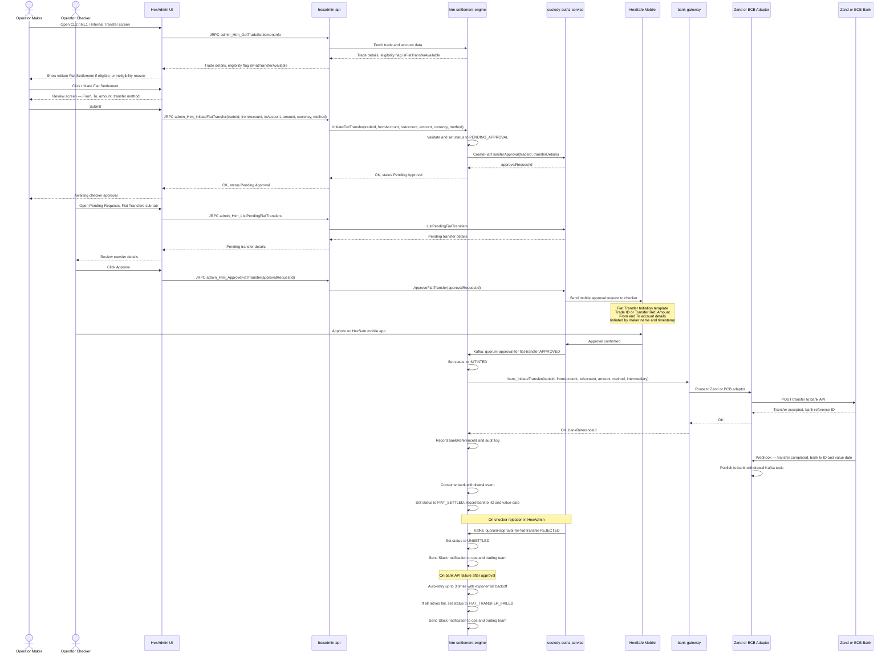

# Fiat Transfer Initiation — Tech Design

**Date:** 2026-05-15
**Status:** Draft
**Author:** rock.zeng
**Related spec:** [2026-05-12-fiat-initiation-on-settlement-design.md](./2026-05-12-fiat-initiation-on-settlement-design.md)

---

## 1. Architecture

### 1.1 Existing Bank Integration Layer

Three repos already form the bank integration stack:

| Repo | Role |
|---|---|
| `hexsafe-2-bank-gateway` | Central JRPC gateway; exposes `bank_InitiateTransfer`; routes to Zand or BCB adaptor by bank identifier |
| `hexsafe-2-zand-bank-adaptor` | Zand Bank API client; handles domestic + international transfers; publishes to `bank-deposit` / `bank-withdrawal` Kafka topics via webhooks |
| `hexsafe-2-bcb-bank-adaptor` | BCB Bank API client; exposes `bcb_bank_AuthorizePayment` (`POST https://api.bcb.group/v5/payments/authorise`); publishes to `bank-deposit` / `bank-withdrawal` Kafka topics via webhooks |

`htm-htm-settlement-engine` is already an authorised client of both adaptors.

### 1.2 Component Responsibilities for This Feature

```
HexAdmin UI
    │  JRPC (admin_Htm_* methods)
    ▼
hexsafe-2-hexadmin-api-gateway     ← routes admin_* prefix to hexadmin-api
    │  JRPC
    ▼
hexsafe-2-hexadmin-api             ← BFF; handles auth, validation, calls downstream
    │  JRPC (htm_hse client)
    ▼
htm-htm-settlement-engine          ← owns fiat leg state machine
    │  bank_InitiateTransfer (JRPC)
    ▼
hexsafe-2-bank-gateway             ← routes by bank identifier (Zand / BCB)
    │                    │
    ▼                    ▼
Zand adaptor         BCB adaptor
    │  webhook            │  webhook
    └──────────┬──────────┘
               ▼
    bank-deposit / bank-withdrawal (Kafka)
               │
               ▼
htm-htm-settlement-engine          ← consumes to update fiat leg status
```

- **`hexsafe-2-hexadmin-api`** is the BFF layer sitting between HexAdmin UI and all downstream services; all `admin_Htm_*` JRPC methods are registered here and forwarded to the settlement engine via the `htm_hse` client package
- **`htm-htm-settlement-engine`** owns the fiat leg state machine; calls `bank_InitiateTransfer` for outgoing transfers; consumes `bank-deposit` / `bank-withdrawal` Kafka events to track status; integrates with `custody-authz-service` for maker-checker approval
- **`hexsafe-2-bank-gateway`** needs BCB routing added (currently only Zand is wired in); routing decision (Fedwire vs SWIFT+intermediary) is determined here based on beneficiary bank account data
- **`hexsafe-2-bcb-bank-adaptor`** — the BCB API `intermediary_bank` object supports both `bic` and `routing_number`; for USD SWIFT transfers routed via Standard Chartered, pass Standard Chartered's Fedwire/ABA number in `routing_number`
- **`HexAdmin UI`** adds the initiation screens, Fiat Transfers sub-tab under Pending Requests, and incoming transaction matching UI

### 1.3 Incoming Transaction Detection

Both Zand and BCB push webhooks for **all** incoming transactions on Hex's settlement accounts — not only transactions initiated through Hex's API. The adaptors publish these to the `bank-deposit` Kafka topic. The settlement engine consumes this topic to detect and store incoming transactions. **No polling job is needed.**

### 1.4 Fiat Leg State Machine

Fiat legs extend the existing `SettlementStatus` enum in `htm-htm-settlement-engine/internal/constant/status.go` with minimal new states.

**New states to add:**

| New state | Used by |
|---|---|
| `INCOMING_CLIENT_LEG_FIAT_PENDING_APPROVAL` | CL2: awaiting checker approval before bank transfer |
| `OUTGOING_LP_LEG_FIAT_PENDING_APPROVAL` | ML1: awaiting checker approval before bank transfer |
| `FIAT_TRANSFER_FAILED` | CL2, ML1, UC5: terminal failure after retries exhausted |

**State transitions:**

*CL2 — Outgoing fiat (Hex pays client):*
```
UNSETTLED
  → INCOMING_CLIENT_LEG_FIAT_PENDING_APPROVAL   (maker submits)
  → INCOMING_CLIENT_LEG_INITIATED               (reuse: bank transfer submitted after approval)
  → INCOMING_CLIENT_LEG_SETTLED                 (reuse: bank confirms via webhook)
  → FIAT_TRANSFER_FAILED                        (new: all retries exhausted)
  → UNSETTLED                                   (on checker rejection)
```

*ML1 — Outgoing fiat (Hex pays LP):*
```
UNSETTLED
  → OUTGOING_LP_LEG_FIAT_PENDING_APPROVAL       (maker submits)
  → OUTGOING_LP_LEG_INITIATED                   (reuse: bank transfer submitted after approval)
  → OUTGOING_LP_LEG_SETTLED                     (reuse: bank confirms via webhook)
  → FIAT_TRANSFER_FAILED                        (new: all retries exhausted)
  → UNSETTLED                                   (on checker rejection)
```

*CL1 — Incoming fiat (client pays Hex, ops confirms):*
```
UNSETTLED
  → OUTGOING_CLIENT_LEG_SETTLED                 (reuse: ops selects matching bank-deposit transactions)
```

*ML2 — Incoming fiat (LP pays Hex, ops confirms):*
```
UNSETTLED
  → INCOMING_LP_LEG_SETTLED                     (reuse: ops selects matching bank-deposit transactions)
```

---

## 2. Sequence Diagram — Fiat Initiation Flow (UC1 / UC2 / UC5)

> **Open item:** How does the front-end know whether to enable the Initiate Fiat Settlement button? The settlement engine should return an eligibility flag (e.g. `isFiatTransferAvailable`) per trade. Needs confirmation from Dmitry and Hao.



---

## 3. Sequence Diagram — Incoming Fiat Transaction Confirmation Flow (UC3 / UC4)


---

*Dev effort, estimates, and development plan to be added after architecture review.*
