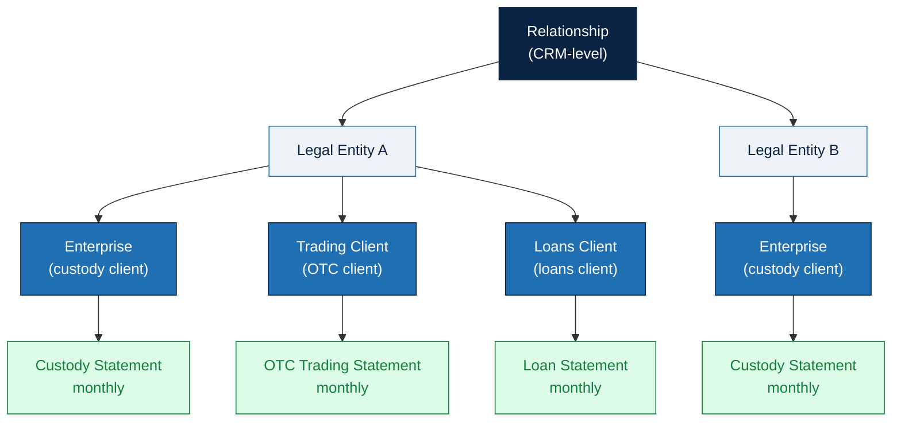

# Monthly Client Statement Application — PRD v1

| Field | Value |
|---|---|
| **Version** | v1 (draft for stakeholder + dev alignment) |
| **Owner** | Rock Zeng — Product, HexSafe |
| **Status** | Draft — pending Compliance, Customer Support, Tech sign-off |
| **Target launch** | TBD (forward-only, no backfill) |
| **Companion artefacts** | `statements_mockup.html` · `sample-statements/*` (PDF + DOCX, Simplified + Detailed for Custody / OTC / Loans) |

---

## 1. Problem & goal

Hex Trust today has an inconsistent client-statement story:

- **Custody statements** are auto-generated but **not exposed in the
  client portal** — clients only receive them on request.
- **OTC Trading and Loan statements** are **compiled manually** by
  Customer Support + Operator from multiple internal systems (Excel /
  Word) and emailed to clients.

This is slow, error-prone, hard to audit, and creates regulatory
exposure. The platform needs a unified flow that:

1. Auto-generates **all three** statement types on the same cadence;
2. Gives Customer Support a single **review-and-release** surface
   (the HexAdmin queue);
3. Surfaces every approved statement to clients via the **Reporting
   Hub**, meeting MAS / VARA record-keeping and disclosure requirements.

**Goal:** an automated platform that, on the 1st of each month,
generates, reviews, publishes and notifies clients of their monthly
statements — one statement per client per service per month —
covering Custody, OTC Trading and Loans.

**Success metric:** ≥ 90 % of client statements published within 7
calendar days of period close, with zero manual data-entry per
statement.

## 2. In scope (v1)

- Three statement types, one per service per **client** per month:
  **Custody**, **OTC Trading**, **Loans**
- **Detailed view only** in v1 (full transactional). Simplified view
  is deferred to v2 — pending business alignment.
- Generation cron at 01:00 UTC on the 1st of each month covering the
  prior calendar month (00:00:00–23:59:59 UTC)
- HexAdmin **review + manual approval** flow before each statement is
  published to the client portal
- Client-facing **Reporting Hub** in HexSafe (full-page takeover from
  the avatar menu) with multi-select download and bulk ZIP export
- Email notification to Admin + Admin Approver of the Relationship on
  publish + on re-issue
- **Source-data-only** correction model — all corrections happen
  upstream; statements are regenerated, never edited directly
- **Silent replace** on re-issue (with audit log entry and notification)
- **Indefinite retention** while client is active; **7 years** post-offboarding
- English UI; **reporting currency follows the client's default currency
  setting** (multi-currency supported in v1)
- PDF output only (CSV out of scope for v1)

## 3. Out of scope (v1 — deferred)

| Item | Defer to |
|---|---|
| Simplified view variant | v2 (Detailed only in v1, pending business alignment) |
| CSV export per statement | v2 |
| Loan drawdown / repayment history | v2 (positions + period interest only in v1) |
| Auto-publish (no manual review) | Post-launch, per-client opt-in |
| Backfill of historical periods | Out — historical manual PDFs remain accessible separately |
| Referral fees on statement | Out — BD-owned, separate workflow |

## 4. Users & permissions

### Client-side (HexSafe portal)
| Role | Access |
|---|---|
| **Admin** | Reporting Hub visible, all statements downloadable, receives email notifications |
| **Admin Approver** | Same as Admin |
| **Other user roles** | Reporting Hub hidden — no statement access |

### Hex Trust-side (HexAdmin)
| Role | Capability |
|---|---|
| Customer Support | Review generated statements, approve to publish, trigger re-generation |
| Operator | Same as Customer Support |

## 5. Data model — Relationship & entity scoping

- **CRM-level Relationship** is the top-level client object (new data
  object). It groups N legal entities.
- Each entity is one of: **Enterprise** (custody), **Trading Client**
  (OTC), **Loans Client** (loans). A single legal entity can have 0..N
  of each.
- **Issuing entity per service** is a fixed per-jurisdiction mapping
  (e.g. SG custody → HexSafe SG; MENA custody → HexSafe MENA; OTC →
  HT Markets SVG or MENA; Loans → loan-licensed entity). Compliance
  owns the table.
- One statement is produced per `{Client, Service, Period}` tuple.
  Not aggregated across the Relationship in v1.

### Diagram — Relationship → Entities → Statements



*One Relationship → many Legal Entities → each entity carries 0..N of
{Enterprise / Trading Client / Loans Client} → one statement per entity
per service per month.*

## 6. UX — Reporting Hub

Two interactive mockups (open in any browser):

| Persona | Mockup | What's inside |
|---|---|---|
| **Client** (HexSafe Reporting Hub) | [Open client mockup](https://htmlpreview.github.io/?https://github.com/hextrust-rock-zeng/products_doc/blob/feature/monthly-statement-mockup/mockup/monthly_client_statement/statements_mockup.html) | Full-page Reporting Hub, month-grouped statements list, multi-select download. *Mockup view* dropdown (bottom-right) switches between Default · Bulk-selected · Empty. |
| **HexAdmin** (Customer Support / Operator) | [Open HexAdmin mockup](https://htmlpreview.github.io/?https://github.com/hextrust-rock-zeng/products_doc/blob/feature/monthly-statement-mockup/mockup/monthly_client_statement/hexadmin_statements_mockup.html) | Fee Calculation › Client Statements with **Custody · Trading · Loans** sub-tabs. Each sub-tab supports All-Entities or specific-entity selection + month picker + Generate. Queue below shows draft / pending / published statements with Preview · Approve & Publish · Re-issue. |

**Placement:** new top-level entry in the user/avatar dropdown menu,
between **Settings** and **Help Center**.

**Navigation model:** clicking *Reporting Hub* opens a **full-page
takeover** — no left sidebar, no per-Enterprise / currency selectors
visible. A *← Back to Custody Wallet* button in the top bar returns
the user to the previous HexSafe context.

### Page: Monthly Statements (v1's only Reporting Hub tab)

- **Filter bar**: `Year` · `Service` (multi-select each). No Enterprise
  filter (page is implicitly entity-scoped to whatever the user has
  access to).
- **Month groups**, newest first. Latest month auto-expanded; older
  months collapsed.
- Within a month, statements sub-grouped by **Custody → OTC Trading →
  Loans** with colour pip indicators.
- Each row: `Service Statement — <Month Year>` + per-row download
  button.
- **Multi-select** checkbox per row + per-month + global. When ≥ 1
  selected, a navy bulk-action bar appears with `Download as ZIP` +
  *Clear selection*.
- Empty state: friendly icon + "No statements match these filters" +
  *Clear filters* button.

See `statements_mockup.html` for interactive reference. Three demo
states (Default / Bulk-selected / Empty) selectable via the bottom-right
*Mockup view* switcher.

## 7. Statement content — by service

Reference layout: see `sample-statements/` for Simplified + Detailed
PDF and DOCX per service. Each statement opens with a shared **Summary
page** (period, snapshot timestamp, client name, issuing entity, MAS
PSN04 / VARA disclosure block, and a service-specific *Pending Items*
block where applicable) before the sections below.

### 7.1 Custody Statement

**Simplified view** — enterprise-rolled-up only, no per-vault and no
individual transactions:
- A. Opening & Closing Balances per Asset (rolled-up across all vaults)
- B. Period Activity — Total Received & Sent per asset (Transfer-In /
  -Out + Market Settlement-In / -Out; excludes internal staking ops)
- C. NFT Balance (aggregate qty only, no fiat valuation)
- D. Staking sub-section (aggregate Position + Rewards & lifecycle)
- E. Fees (custody / withdrawal / staking; MAS PSN04 fee-transparency
  format)

**Detailed view** — same enterprise roll-up plus per-vault supporting
detail:
- A. Opening & Closing Balances per Asset (Enterprise-rolled-up)
- B. NFT Balance (Enterprise-rolled-up)
- C. Staking (Enterprise-rolled-up)
- D. **Per-Vault Breakdown** — for each vault: opening/closing
  balances, full transaction list, NFT balance, staking position,
  staking transactions
- E. **Pending Transactions** (Travel Rule pending + internal-approval
  pending)

### 7.2 OTC Trading Statement

**Simplified view:**
- **Activity by Trading Pair** — one row per pair: # trades, gross
  notional, net base qty (signed), avg exec price, settled count,
  unsettled count + totals row
- All-in price disclosure (HT Markets acts as principal; no separate
  trading fees; spread may be embedded)

**Detailed view:**
- A. **Trade List** — one row per trade (Trade ID / timestamp / pair /
  side / qty / exec price / notional / status / settled-on)
- B. **Settlement Movements** — two rows per settled trade (Received
  leg + Paid leg), linked to the trade above by Trade ID; covers
  Giovanni's reconciliation gap
- All-in price disclosure (same as Simplified)

Settlement movements are the same Market Settlement-In / Market
Settlement-Out events recorded in the Custody section — presented here
with explicit Trade-ID linkage, not duplicated bookings.

### 7.3 Loan Statement

**Simplified view:**
- A. Borrowing positions (Loan ID / Borrowed qty + fiat / Collateral
  qty + fiat / LTV (green < 70 % / amber 70–80 % / red ≥ 80 %) / Rate /
  Opened)
- B. Lending positions (Loan ID / Asset lent / Rate / Term / Opened /
  Maturity)
- C. **Period interest** (accrued / paid / outstanding per loan,
  qty + fiat-equivalent, per asset)

**Detailed view** — same A / B / C plus:
- Per-borrowing-position info card (collateral location, margin /
  liquidation thresholds, rate type, maturity)
- Per-lending-position info card (asset custody, rate type, term, days
  to maturity, roll-over rules)
- D. **Margin & collateral events** (LTV warnings, top-ups,
  liquidations with timestamps)

## 8. Generation pipeline

```
                 ┌───────────────┐
   01:00 UTC ─►  │ Cron trigger  │  (1st of each month, covers M-1)
                 └──────┬────────┘
                        │
                 ┌──────▼──────────────┐
                 │ For each client     │
                 │  × Service × period │
                 └──────┬──────────────┘
                        │
                 ┌──────▼──────────────────────┐
                 │ Fetch from source services: │
                 │  • Custody (positions, txs) │
                 │  • Markets (trades, settle) │
                 │  • Loans (positions, int.)  │
                 │  • Asset Evaluator (prices) │
                 │  • Travel Rule status       │
                 │  • External Positions       │
                 └──────┬──────────────────────┘
                        │
                 ┌──────▼─────────────┐
                 │ Render PDF (and    │  ← single source-of-truth
                 │   internal preview)│     renderer (no DOCX in v1)
                 └──────┬─────────────┘
                        │
                 ┌──────▼─────────────┐
                 │ Store as DRAFT in  │  ← appears in HexAdmin queue
                 │ HexAdmin queue     │
                 └──────┬─────────────┘
                        │
                 ┌──────▼─────────────┐
                 │ MANUAL APPROVAL    │  ← Customer Support reviews + approves
                 └──────┬─────────────┘
                        │
                 ┌──────▼─────────────┐
                 │ PUBLISHED →        │  ← visible in Reporting Hub
                 │   client portal    │     + email to Admins
                 └────────────────────┘
```

### Re-issue flow

Triggered when source data changes after publish (e.g. failure of
detecting transactions).

1. Production support fixes the data source (e.g. by replaying blocks).
   Source audit applies.
2. Client Support re-triggers statement generation for the affected
   period.
3. New draft replaces the published one **silently** (silent replace).
4. **Audit log entry** records the re-issue (operator, timestamp).
5. **No notification to client on re-generation.**

### Cut-off & timezone
- Period boundary: **23:59:59 UTC** on the last day of the calendar
  month
- Cron fires at **00:00 UTC on the 1st** of the next month
- All timestamps in statements are UTC

### Approval gate
- **Mandatory manual approval per statement** in v1
- No auto-publish; post-launch re-evaluation may add an opt-in
  auto-publish toggle per client

### Backfill
- Launch month forward only by default, **but new logic + existing data
  can be used to (re-)generate older statements if needed**.
- Old and new client-statement modules **can run in parallel for the
  first few months** if needed.
- No client comms needed before launch.

## 9. Edge cases

| Scenario | Behaviour |
|---|---|
| New client mid-month | First statement: period = onboarding date → period end. Period clearly labelled. |
| Mid-month offboarding | Final statement labelled "FINAL STATEMENT", period = period start → offboarding date. Active delivery + retention. |
| Zero-activity month | Still produce statement showing opening = closing. Standard banking practice. |
| OTC trade settles after period end | Trade appears in the period it was *booked*; flagged "Unsettled at period end"; subsequent period's Settlement Movements section shows the asset moves. |
| Source data fundamentally wrong (not just a price tick) | Same source-data fix + re-issue path. No statement-level override allowed. |

## 10. Notifications

| Trigger | Recipients | Channel | Content |
|---|---|---|---|
| Statement published | Admin + Admin Approver of the Relationship | Email | "Your statements for {Month} are ready" + deep-link |

## 11. Retention & access

- **Active client**: indefinite — every published statement remains
  downloadable in Reporting Hub
- **Post-offboarding**: 7 years (matches MAS / VARA record-keeping
  retention); access via support request after portal access
  terminates
- Storage: object store (S3 / equivalent); cost is negligible

## 12. Compliance & disclosure

- Each statement carries the **issuing entity's regulatory disclosure
  block** at the foot (MAS PSN04 for SG, VARA equivalents for MENA).
  Compliance owns the exact text per jurisdiction. Current production
  wording (used as the baseline):

  > **Disclaimer:** The client must review the information in the
  > monthly statement and give Hex Trust written notice of any
  > suspected error or omission as soon as reasonably possible (in any
  > event, no later than 7 days of accessing / receiving the
  > statement). Hex Trust will not be liable with respect to any error
  > or omission in the monthly statement (including any reliance on any
  > such error or omission) unless the client has timely objected in
  > writing as aforementioned, unless such error or omission is the
  > result of Hex Trust's bad faith or willful default.

- Travel Rule (FATF R.16) pending items surface in the Custody
  statement's *Pending Items* section.
- SG-mandated transaction reason codes are honoured throughout the
  Detailed view (Transfer-In, Transfer-Out, Market Settlement-In/Out,
  Stake, Unstake, Unbond, Redeem, Claiming Rewards, Validator
  Commission, Vote).

## 13. Open items / business follow-ups

| # | Topic | Owner |
|---|---|---|
| 1 | Staking commission: should we put on client statement? if yes, how can we get the commission? | Business |
| 2 | Simplified view variant — keep, drop, or defer to v2? | Business |
| 3 | Auto-publish opt-in policy & UX | Customer Support |
| 4 | Notification template wording (subject / sender / body) | Customer Support + Custody |
| 5 | Per-jurisdiction disclosure text (issuing-entity mapping table) | Custody + Compliance + Markets |

---

*End of PRD v1 draft.*
