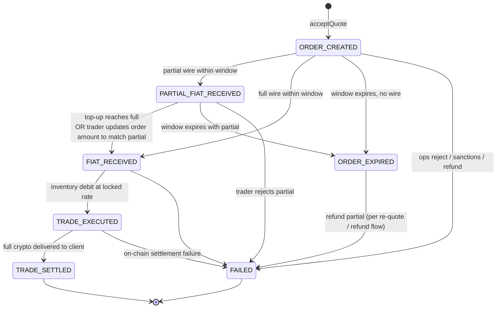
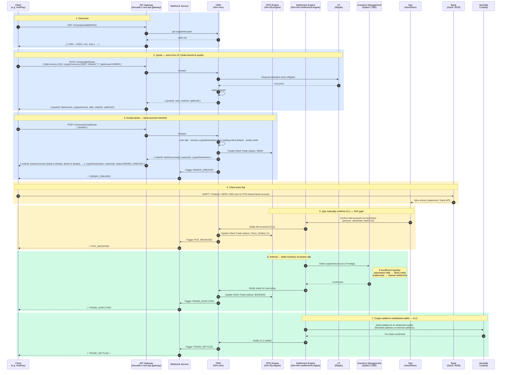

# On-Ramp Trading API — Business Flow (DvP-atomic)

**Status:** Draft for business / UX alignment
**Date:** 2026-05-27
**Author:** rock.zeng
**Model:** DvP-atomic — confirmed with Rohit (stablecoin-only · inventory-only · settle-after-fiat-confirmed)
**Supersedes:** [sequence-diagram.md](sequence-diagram.md) (pre-fund model — retained as Phase 2 reference)
**Mirror of:** [Convert-to-Pay](../convert-to-pay/convert-to-pay-openapi.yaml) (off-ramp), inverted direction

---

## 1. Scope

| | Convert-to-Pay (off-ramp, today) | **On-Ramp (this spec)** |
|---|---|---|
| Direction | crypto in → fiat out | **fiat in → crypto out** |
| Crypto leg | any supported asset | **stablecoins only (Phase 1)** — USDC, USDT |
| **Price source** | (derived from FX + LP) | **LP quote — Ripple (Phase 1)**, spread applied |
| **Trade execution** | LP hedge (Haruko routing) | **from Hex Trust inventory** (no LP trade per order) |
| Funding model | atomic (deposit address per quote) | **atomic (shared HTM bank account)** |
| CL1 confirmation | auto (on-chain detection) | **manual ops** via HexAdmin |
| Client holds a balance? | no | **no** — fiat is in-flight only |

**Jurisdiction scoping (implicit, server-side):** `availablePairs` and all related endpoints filter results by the requesting client's onboarded Hex Trust entity (SVG, SG, UAE, HK …). Each entity carries its own licensed scope of fiat, stablecoins, and chains. Phase 1 launches under **SVG** (St. Vincent and the Grenadines).

Three Phase-1 constraints from Rohit, which together dissolve the rate-lock-over-slow-wire concern that motivated the pre-fund draft:
1. **Stablecoins only** — USDC/USDT track fiat ±0.1%, so rate-lock across a multi-day wire carries near-zero FX risk.
2. **Trade from inventory** — no LP hedge round-trip, so no short LP window racing a long wire.
3. **DvP gate** — "won't settle to them unless they settle to us": crypto-out is gated on ops confirming fiat-in.

See ADR-001 for the full rationale.

---

## 2. Architecture Decision Records

### ADR-001 — DvP-atomic (not pre-fund)

**Decision:** On-ramp orders are atomic per-quote. `acceptQuote` returns a bank account + reference, the client wires fiat, ops manually confirms CL1, then crypto settles to the client wallet. **Hex Trust does NOT hold client fiat balances** — fiat is in-flight only during the order window.

**Why:**
- **Stablecoin inventory** → rate-lock during a multi-day wire is near-zero risk (USDC/USDT track fiat ±0.1%). The original concern that motivated pre-fund (long wire vs short quote) doesn't apply when the underlying instrument barely moves.
- **Decoupled price source vs execution venue** → LP (Ripple Phase 1) provides the **live price** at `getQuote` time; the **trade itself executes from Hex Trust inventory**, not against the LP. This means the locked rate can be held for the full order window without forcing a short LP-hedge window. Hex Trust absorbs any LP-price drift during the window — safe for stablecoins (±0.1%).
- **DvP via ops** → manual CL1 confirmation in HexAdmin is the gate that satisfies "settle to us before we settle to you."

**Consequences:**
- **Regulatory:** no client balance → no e-money / SVF / account-issuance scope debate (see §9).
- **API:** near-perfect mirror of Convert-to-Pay — a client integrating CTP can integrate on-ramp in days, not weeks.
- **Pre-fund model** (the v2 draft in [sequence-diagram.md](sequence-diagram.md)) is preserved for **Phase 2** — needed if/when Hex Trust extends to volatile pairs or chooses LP-hedged execution.

### ADR-002 — Separate endpoint set (`/onramp/*`) — unchanged

`/onramp/*` is parallel to `/convert-to-pay/*`. A future `/swap/*` serves crypto-to-crypto. Symmetry enforced (auth, webhook envelope, error namespace, pagination) so a future unified `/trade/*` would be a docs-only re-skin.

### ADR-003 — Phase 1 scope freeze

**Decision:** This design holds explicitly for **stablecoin Phase 1 with inventory-funded execution**. Phase 2 reopens ADR-001 because:
- Volatile pairs → rate-lock over a multi-day wire carries real FX risk → revisit pre-fund or re-quote-at-arrival models.
- LP-hedged execution → LP quote windows force shorter rate locks → revisit re-quote.

A separate Phase 2 design pass is required before expanding scope; **do not retrofit this design blindly**.

---

## 3. Endpoints — near-perfect mirror of Convert-to-Pay

| # | Convert-to-Pay (off-ramp) | **On-ramp (this spec)** | Purpose |
|---|---|---|---|
| 1 | `GET /convert-to-pay/availablePairs` | `GET /onramp/availablePairs` | Supported (fiat → stablecoin) pairs with min/max |
| 2 | `GET /convert-to-pay/assetInfo` | `GET /onramp/assetInfo` | Asset metadata (decimal, symbol, chain) |
| 3 | `POST /convert-to-pay/getQuote` | `POST /onramp/getQuote` | Quote — informational; includes inventory pre-check |
| 4 | `POST /convert-to-pay/acceptQuote` → returns **crypto deposit address** | `POST /onramp/acceptQuote` → returns **fiat bank account + reference** | Bind quote → return payment instructions |
| 5 | `GET /convert-to-pay/paymentStatus` | `GET /onramp/orderStatus` | Query order state by `orderId` |
| 6 | `GET /convert-to-pay/paymentHistory` | `GET /onramp/orderHistory` | List orders over a date range |

---

## 4. Order state machine

Single linear lifecycle, mirroring Convert-to-Pay.



### State definitions

| State | What it means | Driven by |
|---|---|---|
| `ORDER_CREATED` | Quote accepted, rate locked, bank account issued, awaiting fiat | Client |
| `PARTIAL_FIAT_RECEIVED` | One or more wires received, cumulative < `fiatAmount` | Bank → Ops |
| `FIAT_RECEIVED` | Full fiat amount confirmed by ops (CL1 settled) | Ops |
| `TRADE_EXECUTED` | Inventory debited at locked rate (internal accounting; no LP) | System |
| `TRADE_SETTLED` ✓ | Stablecoin on-chain confirmed to client wallet (terminal) — always full amount in one shot | Custody |
| `ORDER_EXPIRED` | Window elapsed; partial wires get re-quoted (new order) or refunded | System |
| `FAILED` ✗ | Terminal failure (ops reject, sanctions, on-chain failure, refund initiated) | Ops / System |

---

## 5. Sequence diagram



---

## 6. Webhook events

Mirror of Convert-to-Pay webhooks, inverted direction — including the CTP envelope conventions. At-least-once delivery with a flat per-webhook-URL retry interval (configured at onboarding); client dedupes by `payload.id`. Webhook delivery to clients is handled by the **Webhook Service**, triggered by **OMS**. OMS is the central coordinator: it receives state-change notifications (from Settlement Engine), propagates them to RFQ Engine, and triggers the Webhook Service to fire the corresponding webhook. The API Gateway handles only inbound REST traffic.

**Payload shape** — every webhook is a CTP-style envelope:

```
{
  "payload": {
    "eventType": "...",
    "id": "<webhook delivery uuid>",
    "currentWebhookCallAt": "ISO 8601",
    "eventTriggerAt": "ISO 8601",
    "firstWebhookCallAt": "ISO 8601",
    "retryNum": 0,
    "data": { "orderId", "clientOrderId", "order": { ...full order snapshot... } },
    "metadata": { "apiVersion", "environment" }
  },
  "signature": "<base64 Ed25519 signature over JSON-marshaled payload>"
}
```

The `data.order` snapshot is identical in shape to `GET /onramp/orderStatus` and reflects **post-event state**. The `eventType` enum tells you what just changed; `data.order` tells you everything else (latest bank tx in `order.fiatDepositTransactions[]`, on-chain tx in `order.cryptoSettlementTransactions[]`, `order.failureReason`, etc.).

| Convert-to-Pay event | **On-ramp event** | Fires when |
|---|---|---|
| `QUOTE_ACCEPTED` | `ORDER_CREATED` | acceptQuote bound; bank accounts issued |
| `PARTIAL_DEPOSIT_RECEIVED` | `PARTIAL_FIAT_RECEIVED` | Ops confirms partial wire |
| `DEPOSITED` | `FIAT_RECEIVED` | Ops confirms full fiat (CL1 settled) |
| `PAYMENT_EXECUTED` | `TRADE_EXECUTED` | Inventory debited at locked rate |
| `SETTLED_FULL_AMOUNT` ✓ | `TRADE_SETTLED` ✓ | Crypto on-chain confirmed (always full amount in one shot) |
| `QUOTE_EXPIRED` | `ORDER_EXPIRED` | Window elapsed; no/partial wire (handled per re-quote / refund flow) |
| `FAILED` ✗ | `FAILED` ✗ | Terminal failure |

---

## 7. What's specifically different from Convert-to-Pay

Three differences, all consequences of fiat being slow:

1. **DvP gate on settlement.** CTP: on-chain crypto deposit confirms (fast, automatic), fiat payout fires. On-ramp: **ops manually confirms CL1** in HexAdmin before CL2 fires. Same state machine, different trigger source.
2. **Inventory check at quote time.** `getQuote` must verify enough stablecoin inventory exists to honor the trade (with a floor reserve). CTP has no inventory dependency.
3. **Refund destination is the originating bank account only.** Source-of-funds match. CTP refunds crypto to the sending on-chain address (well-defined); fiat refunds need explicit bank-account matching for compliance.

---

## 8. Inventory considerations

**Inventory management is NOT a blocker for the on-ramp API.** Phase 1 deliberately keeps inventory logic minimal — automation falls back to manual when liquidity is insufficient.

| | Phase 1 |
|---|---|
| Price source at quote | LP (Ripple) — live indicative price + Hex Trust spread |
| Inventory pre-check at quote | Not required for day 1. `getQuote` does not gate on inventory level |
| Insufficient inventory at execution time | **Automation fails** → Slack notification to traders + ops → manual settlement |

---

## 9. Regulatory note (significant simplification vs pre-fund)

Compared to the pre-fund model (rejected in ADR-001), DvP-atomic eliminates the client-money question:

- **No client fiat balance** held → no e-money / SVF / account-issuance / safeguarding scope debate.
- **Fiat in-flight** during the order window fits cleanly under Singapore MPI's **Cross-Border Money Transfer Services** + **DPT Services** (Hex Trust holds the MAS MPI license — see [regulatory/licenses-and-certifications.md](../../hextrust_knowledge/regulatory/licenses-and-certifications.md)).
- **The trade itself** fits under VARA **Broker-Dealer Services** (Dubai) + MAS MPI **DPT OTC Trading** (Singapore).
- **HK trustee structure** unaffected.
- **Path A** (partner bank holds the fiat in safeguarded / FBO account at Zand / BCB) applies trivially.

Compliance sign-off still recommended on **order window length** and **refund flow**, but the gating client-money question is no longer in play.

---

## 10. UX / design decisions

Revised for the DvP-atomic model.

| # | Decision | Options | Recommendation |
|---|---|---|---|
| **D1** | **Order window** (acceptQuote → fiat arrival) | (a) 24h / (b) 48h / (c) 72h | **48h default**, override to 72h for SWIFT pairs |
| **D2** | **Late wire** (after `expiresAt`) | (a) auto-refund / (b) re-quote at receipt | **(b) re-quote** — original order expires; system issues a new quote when the wire actually lands, client confirms or refunds |
| **D3** | **Overpayment** | (a) manual refund / (b) book another trade at then-prevailing rate for the excess | **Confirm with the client trade-by-trade** — both supported; ops asks the client per occurrence and proceeds with the chosen handling |
| **D4** | **Crypto destination scope** | Per trading client: a default crypto address is configured per chain. The default address must be a whitelisted address registered in the trading-client counterparty service | Whitelist is the source of truth; per-chain default is picked from it. If no default is configured for the requested chain → automation fails (no per-order address override in Phase 1) |
| **D5** | **Quote validity** (`getQuote` → `acceptQuote`) | (a) 30s / (b) 5 min / (c) 15 min | **(b) 5 min** — long enough for client treasury to act |
| **D6** | **Bank account model** | (a) shared HTM bank account (no per-order reference) / (b) per-customer VAN / (c) hybrid | **(a) Phase 1** — ops matches by amount + originating bank + timing |
| **D7** | **Ops confirmation UX** | manual confirmation on the CL1 settlement screen in HexAdmin | reuses existing fiat settlement screen workflow |
| **D8** | **Partial fiat handling** | No fixed threshold. Trader decides per case: (a) execute partial — update the order amount to match the partial deposit, then trade continues / (b) reject + refund | Order resource must support an **amend amount** action available to traders; no auto-reject |
| **D9** | **Travel Rule data** | Capture in Phase 1 from the registered counterparty on the crypto-out leg | Required at launch — Hex Trust's existing TR plumbing is reused |

---

## 11. Open questions / Phase 1 launch parameters

| | Answer (current) |
|---|---|
| **Stablecoin coverage** | USDC + USDT to start; USDP / PYUSD / EURC / TUSD TBD |
| **Fiat coverage** | USD, EUR, GBP, AED, SGD, HKD — priority TBD |
| **Minimum trade size** | Very small floor, e.g. **10 USD** |
| **Pilot client** | Not identified yet |
| **Legal entity / jurisdiction** | **SVG** (St. Vincent and the Grenadines) |

---

## 12. Backlog / Phase 2 enhancements

Tracked future enhancements — identified during design discussion but not scoped into Phase 1.

| # | Item | Addresses | Approach |
|---|---|---|---|
| **B1** | **LP price sanity check** | Risk of single-source LP price (Ripple only Phase 1) — stale, erroneous, or manipulated quote propagates to client and Hex Trust eats the loss | Cross-check Ripple's quote against a market reference (CoinGecko mid / Chainlink / a second LP). Reject or alert if outside ±X% band. Operator-configurable threshold per stablecoin |
| **B2** | **Per-pair on/off switch** | Operator needs to disable a specific trading pair (e.g. USDT temporarily unavailable, EUR rail down) without taking the whole API down | Admin-only toggle per `(jurisdiction × pair × chain)` — disabled entries disappear from `/availablePairs` and return error from `getQuote`/`acceptQuote` |
| **B3** | **Global on/off switch for on-ramp API** | Operator needs a kill-switch covering the entire on-ramp surface for incident response / planned downtime / regulatory halt | Admin-only toggle; when off, all on-ramp endpoints return a maintenance error. Existing in-flight orders continue to be processed (or held, configurable) |
| **B4** | **Self-serve counterparty whitelist API** | Phase 1 has clients email/Slack ops to add or change whitelisted addresses; doesn't scale | Expose REST endpoints (`GET / POST / PUT / DELETE /onramp/counterparty/addresses`) with address-ownership verification (small deposit + signature). Aligns with the trading-client counterparty service (`htm-htm-counterparty-service`) |
| **B5** | **Inventory reservation at `acceptQuote`** | Phase 1 risks `INSUFFICIENT_INVENTORY` at execution time after the client has already wired fiat → automation fails → manual ops settlement. Reservation eliminates this class of failure | At `acceptQuote`, reserve `cryptoAmount` against the inventory pool with TTL = order window. Release on `ORDER_EXPIRED` / `FAILED`. Consume at `TRADE_EXECUTED`. Adds `INSUFFICIENT_INVENTORY` synchronous error on `acceptQuote` (better client UX than discovering it days later) |

Future entries appended here as design discussions surface them.

---

*Next step after business sign-off:* draft `onramp-openapi.yaml` mirroring `convert-to-pay-openapi.yaml`, then a tech-design doc mapping each endpoint + state transition onto HTM services (`htm-rfq-engine`, `htm-oms`, `htm-htm-settlement-engine`, `hexsafe-2-rest-api-gateway`).
