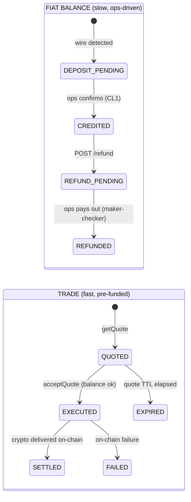
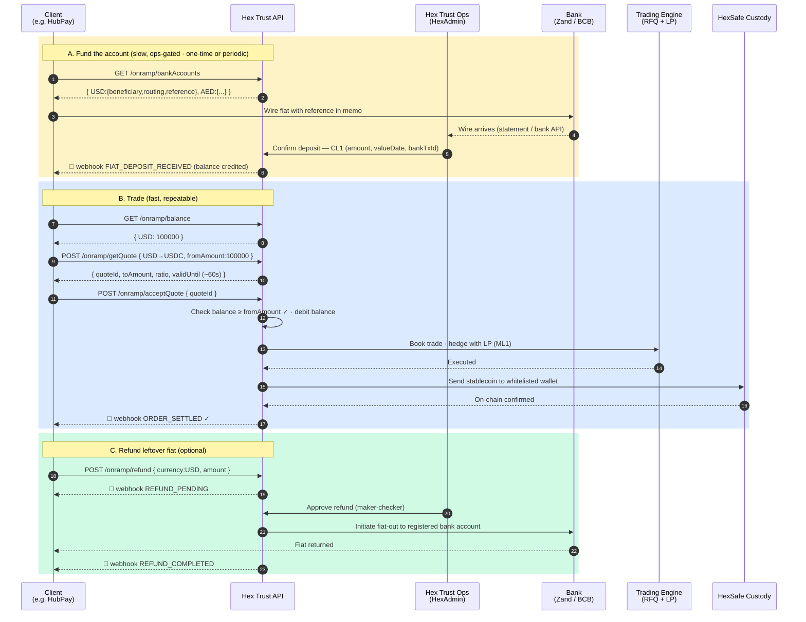

# On-Ramp Trading API — Business Flow

**Status:** Draft for business / UX alignment
**Date:** 2026-05-27
**Author:** rock.zeng
**Model:** Pre-fund (deposit fiat → trade against balance) — confirmed with JY against current OTC desk behavior
**Related:** [Convert-to-Pay](../convert-to-pay/convert-to-pay-openapi.yaml) (off-ramp), [Fiat-initiation-on-settlement](docs/superpowers/specs/2026-05-12-fiat-initiation-on-settlement-design.md)

---

## 1. Scope

| | Convert-to-Pay (off-ramp, today) | **On-Ramp (this spec)** |
|---|---|---|
| Direction | crypto in → fiat out | **fiat in → crypto out** |
| Crypto leg | any supported asset | **stablecoins only (Phase 1)** — USDC, USDT |
| Funding model | atomic (deposit-address per quote) | **pre-fund** (deposit fiat → trade against balance) |
| Fiat rails | AED (Zand), USD (BCB), SWIFT via SCB | same set |
| CL1 confirmation | auto (on-chain detection) | **manual ops** via HexAdmin |
| Target client | HubPay, brokers, treasury platforms | same |

Phase 1 = stablecoins because the crypto leg carries near-zero price risk (USDC/USDT track fiat ±0.1%), so the LP-hedge is trivial and the held-balance FX exposure is negligible. Volatile-asset pairs are Phase 2.

---

## 2. Architecture Decision Records

### ADR-001 — Pre-fund model (not atomic quote-first)

**Decision:** On-ramp uses a pre-fund flow: the client wires fiat first, ops confirms it into a fiat balance, and the client then trades against that balance. Quotes are only executable when sufficient balance exists.

**Rationale:**
- Matches Hex Trust's **actual current OTC desk behavior** (confirmed with JY): we wait to receive client funds, then offer the quote.
- Matches the **institutional industry standard** — Coinbase Prime, BitGo Prime, Kraken, Bitstamp all pre-fund-then-trade. The atomic quote-first model is the *retail* aggregator pattern (MoonPay, Stripe).
- **Dissolves the rate-lock-over-slow-wire problem.** A quote-first model forces a short quote (LP hedge cost) to race a multi-day bank wire — an unavoidable mismatch. Pre-fund moves the slow bank rail *before* quoting, so the quote can be a normal short RFQ (~30–60s).
- **Eliminates three edge cases**: partial-deposit handling, mid-trade overpayment refund, and late-wire re-quote all vanish — you simply trade against whatever balance exists.

**Trade-off accepted:** Holding client fiat balances introduces client-money safeguarding / segregation obligations that the pass-through model avoided (see §7).

### ADR-002 — Separate endpoint set (`/onramp/*`)

**Decision:** `/onramp/*` is a new endpoint set, parallel to `/convert-to-pay/*`. A future `/swap/*` will serve crypto-to-crypto.

**Rationale:**
- Pre-fund on-ramp behaves like a **mini-brokerage account** (deposit → balance → trade → refund), structurally very different from Convert-to-Pay's atomic deposit-address-per-quote model. Forcing both into one endpoint set produces polymorphic responses and a confused state machine.
- Mirrors how Coinbase keeps **Onramp**, **Prime**, and **Convert** as three separate API surfaces.
- Lets on-ramp ship independently of the (not-yet-public) crypto-to-crypto trade API.

**Symmetry enforced** (so a future unified `/trade/*` is a docs-only re-skin): same auth (`X-API-KEY` + signed JWT), same webhook envelope (HMAC signature, retry, dedupe by `orderId + eventType`), same error-code namespace, same pagination conventions.

---

## 3. Endpoints

| # | Endpoint | Purpose |
|---|---|---|
| 1 | `GET  /onramp/availablePairs` | Supported (fiat → stablecoin) pairs with min / max |
| 2 | `GET  /onramp/bankAccounts` | HTM bank account(s) to deposit fiat into, **per currency** |
| 3 | `GET  /onramp/balance` | Client's fiat balance(s), **per currency** |
| 4 | `POST /onramp/getQuote` | RFQ quote (informational), short TTL (~30–60s) |
| 5 | `POST /onramp/acceptQuote` | Execute trade — **guarded by sufficient balance**; settles crypto to whitelisted wallet |
| 6 | `POST /onramp/refund` | Refund fiat balance to client's registered bank account (maker-checker) |
| 7 | `GET  /onramp/orders` | Trade history (supporting) |
| 8 | `GET  /onramp/deposits` | Deposit history — which wires landed, when (supporting) |

---

## 4. Two decoupled lifecycles

The defining mental model of the pre-fund design: the **fiat-balance** side is slow and ops-gated; the **trade** side is fast and atomic because the balance already exists. They touch only at `acceptQuote` (balance debit).

---

## 5. Sequence diagram

---

## 6. Webhook events

Same envelope convention as Convert-to-Pay webhooks. At-least-once delivery, HMAC-signed, exponential-backoff retry; client dedupes by `orderId + eventType` (or `depositId` / `refundId`).

| Event | Fires when | Key payload fields |
|---|---|---|
| `FIAT_DEPOSIT_PENDING` *(optional)* | Wire detected, ops not yet confirmed | `depositId`, `currency`, `amount`, `detectedAt` |
| `FIAT_DEPOSIT_RECEIVED` | Ops confirms deposit, balance credited (CL1) | `depositId`, `currency`, `amount`, `bankTxId`, `valueDate`, `newBalance` |
| `ORDER_EXECUTED` *(optional split)* | Trade booked & hedged | `orderId`, `executedToAmount`, `executedAt` |
| `ORDER_SETTLED` ✓ | Crypto on-chain confirmed to client wallet | `orderId`, `txHash`, `settledToAmount`, `chainId`, `newBalance` |
| `ORDER_FAILED` ✗ | On-chain settlement failure (balance restored) | `orderId`, `failureReason`, `newBalance` |
| `REFUND_PENDING` | Refund requested, awaiting ops approval | `refundId`, `currency`, `amount` |
| `REFUND_COMPLETED` ✓ | Fiat returned to registered bank account | `refundId`, `bankTxId`, `newBalance` |
| `REFUND_REJECTED` ✗ | Ops rejected refund (e.g. bank mismatch) | `refundId`, `reason` |

> Note: `getQuote` → `acceptQuote` happens in a single fast round-trip, so `ORDER_EXECUTED` and `ORDER_SETTLED` may collapse into one event in practice. Splitting them lets clients distinguish "trade done" from "crypto on-chain confirmed."

---

## 7. UX / design decisions to align with business

Revised for the pre-fund model. Decisions that existed in the atomic draft but no longer apply (order window, late-wire, partial-deposit, mid-trade overpayment) have been removed.

| # | Decision | Options | Recommendation |
|---|---|---|---|
| **D1** | **Crypto delivery after trade** | (a) auto-settle to whitelisted wallet immediately  (b) accrue as crypto balance + separate `/withdraw` endpoint | **(a) auto-settle** for Phase 1 (simplest); (b) is the full brokerage model, Phase 2 |
| **D2** | **Crypto destination scope** | (a) whitelisted in [counterparty book](../../hextrust_knowledge/source-code/features/counterparty-book.md)  (b) client default per chain, set at onboarding  (c) arbitrary per `acceptQuote` | **(b) default-per-chain** for the first cut; (a) toggle for heightened-risk enterprises |
| **D3** | **Quote TTL** (`getQuote` → `acceptQuote`) | (a) 30s  (b) 60s  (c) 2 min | **(b) 60s** — no slow rail in the loop now, so this can be tight |
| **D4** | **Bank account model** | (a) shared HTM account + per-client reference code  (b) per-customer virtual account (VAN)  (c) hybrid | **(a) for Phase 1** (Zand/BCB don't issue VANs today); migrate to (c) later |
| **D5** | **Deposit confirmation UX** | (a) manual ops match  (b) auto-match by reference + ops approve  (c) full auto | **(b) auto-match + approve** — reuses fiat-initiation-on-settlement work |
| **D6** | **Refund destination** | (a) any registered bank account  (b) only the originating bank account (source-of-funds match) | **(b)** — strict source-of-funds match; compliance-safer |
| **D7** | **Balance dimension** | per-currency map (USD / EUR / AED each separate) — a balance only funds a same-currency quote | Confirm currency set with business (§9) |
| **D8** | **Idle-balance handling** | (a) hold indefinitely  (b) auto-refund after N days idle  (c) charge custody fee on idle fiat | **(a)** for Phase 1; revisit if safeguarding cost demands (b)/(c) |
| **D9** | **Travel Rule data** | (a) skip Phase 1 (sweeps bypass TR today per [settlement-engine](../../hextrust_knowledge/source-code/features/settlement-engine.md))  (b) capture from registered counterparty | **(b)** for institutional TR-obligated clients on the crypto-out leg |

---

## 8. Compliance flag — client-money safeguarding

The single genuinely new risk vs the pass-through Convert-to-Pay model: **holding client fiat balances** may trigger client-money safeguarding / segregation obligations, and possibly e-money or deposit-taking considerations, depending on the issuing entity's jurisdiction (SG / UAE / HK). This must be cleared with compliance before build:

- Are held fiat balances segregated from Hex Trust operating funds?
- Which entity holds the balance, and is that activity within its license scope?
- Is there a maximum hold period or balance cap per client?

---

## 9. Open questions for business

1. **Stablecoin coverage** — USDC + USDT only, or also USDP / PYUSD / EURC / TUSD?
2. **Fiat coverage** — USD, EUR, GBP, AED, SGD, HKD? Phase 1 priority order?
3. **Client onboarding** — separate KYB pass, or piggy-back on existing Hex Safe onboarding?
4. **Minimum trade size & minimum deposit** — same floor as Convert-to-Pay or higher?
5. **Crypto delivery** — auto-settle (D1a) confirmed, or do clients want to hold crypto balances (D1b)?
6. **Pilot client** — HubPay again, or a new design partner?
7. **Legal entity / jurisdiction** — which entity issues the order and holds the fiat balance (SG / UAE / HK)?
8. **Safeguarding** — see §8; compliance sign-off needed before build.

---

## 10. Out of scope for this pass

- OpenAPI 3.0 schema + field-level types (next, after sign-off — mirror `convert-to-pay-openapi.yaml`)
- Auth / header model (will follow Convert-to-Pay: `X-API-KEY` + signed JWT)
- Error codes
- Internal architecture mapping (which HTM service owns balance ledger, quote, settlement)
- HexAdmin ops UI (deposit-match queue, refund approval, audit trail)
- Fee structure (placeholder: spread baked into rate, per Convert-to-Pay)
- Phase 2: volatile-asset pairs, crypto-balance + withdraw model (D1b), VAN bank accounts

---

*Next step after business sign-off:* draft `onramp-openapi.yaml` mirroring `convert-to-pay-openapi.yaml`, then a tech-design doc mapping each endpoint + lifecycle transition onto HTM services (`htm-rfq-engine`, `htm-oms`, `htm-htm-balance-keeper`, `htm-htm-settlement-engine`, `hexsafe-2-rest-api-gateway`).
